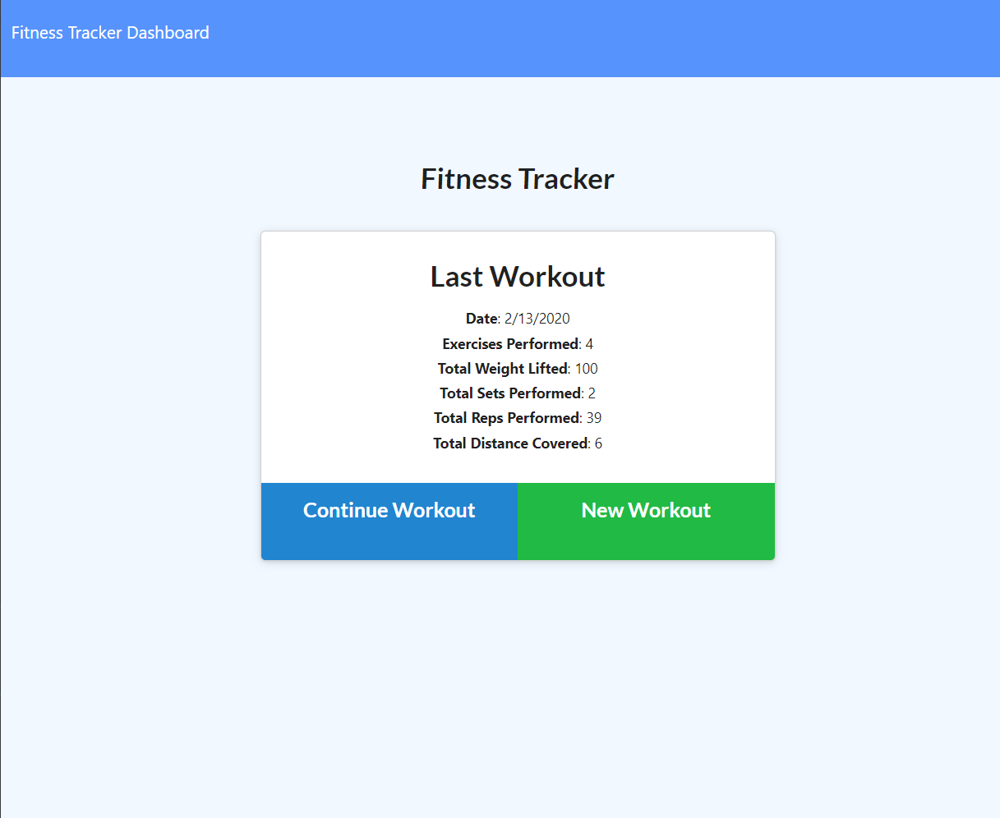

# MongoDB Nosql Homework: Workout Tracker

This is a Mongo database with a Mongoose schema and handles routes with Express. [Link to Heroku application here!](https://fit-ness.herokuapp.com/)

## User Story

* As a user, I want to be able to view create and track daily workouts.

## Business Context

A consumer will reach their fitness goals quicker when they track their workout progress.

## Acceptance Criteria

When the user loads the page, they are given the option to create a new workout, or to continue with their last workout.

The user is be able to:

  * Add exercises to a previous workout plan.

  * Add new exercises to a new workout plan.

Latest Workout Displayed
  Date
  Exercise type (Cardio)
  Total workout duration : minutes
  Exercises performed : (2, 5 times)
  Total weight lifted: 200lbs
  Total sets performed: 1 set
  Total reps performed: 10

### Issues

Today I learned that I only needed 1 Schema-- Workout. Also, I am currently working on the stats page and Total Workout Duration-- this stat is currently undefined. **EDIT** The public folder was missing the definition for totalDuration!!! Had to add it.